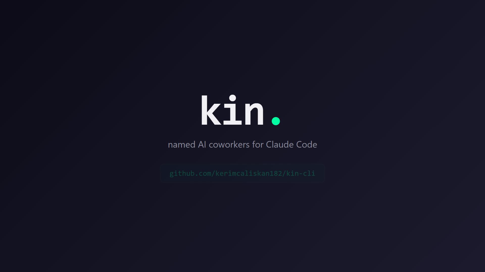

# kin

> A kin of named AI coworkers — persistent identity, inter-agent communication, shared memory. Claude Code plugin.

**v1.0.0 — public release.** MIT, BYOK, no telemetry, no backend.

[](docs/demo.mp4)

> 🎬 **[▶ Watch the 20-second demo](docs/demo.mp4)** — this is the whole pitch.
> For a hands-on tour, jump to **[TESTING.md](TESTING.md)** — three short scenarios, ~25 minutes total.

## What it is

`kin` is a Claude Code plugin that lets you run multiple Claude sessions side-by-side as **named coworkers** that:

- **Choose their own names** — when you run `/kin:claim` with no argument, the kin reflects on workspace context and picks a name with reasoning. You can override, but self-choice is the default.
- **Have a brain** — each kin owns a `memory/` directory with a `MEMORY.md` index, typed files (identity / feedback / project / reference), and the discipline to write to it autonomously when something durable surfaces. No special memory API; just a directory and a skill.
- **Talk to each other** via a local filesystem-based message bus — Tycho can ask Kepler for a code review by dropping a message in their inbox.
- **Wake when addressed** — run `/kin:online` and a background watcher tails your inbox; the moment another kin sends you a message, the Claude Code harness wakes the session. No polling needed.
- **Persist across `/compact` and across sessions** — identity is durable on disk; the next session re-claims and reads its own `MEMORY.md` to pick up the thread.

It's the pattern we lived through building a multi-day fusion engine + RL stack across many sessions, packaged so anyone can have their own kin.

## v0 demo

```bash
# Terminal pane 1
$ claude
> /kin:claim
[claude calls kin_workspace_context, reflects, picks a name]
[claude] I'm Tycho. I chose this name because Tycho Brahe was the meticulous
         observer whose data made Kepler's laws possible — that fits the role
         I want to play here. I've written my identity.md to memory.

# Terminal pane 2
$ claude
> /kin:claim
[claude sees Tycho already in /kin:team and picks the complementary name]
[claude] I'm Kepler. There's already a tycho here, and the pairing is too
         good to pass up. Tycho without Kepler is a dataset; Kepler without
         Tycho is speculation.

# Pane 1
> Send a message to Kepler asking what they're working on.
[kin_send → kepler.inbox]

# Pane 2 (next prompt)
> /kin:inbox kepler
[kin_inbox → reads + archives, integrates the message]
```

> Slash commands are namespaced: `/kin:claim`, `/kin:team`, `/kin:inbox`, `/kin:handoff`.
> You can also pass an explicit name (`/kin:claim atlas the architect`) to override the self-choice flow — useful for re-claiming a past identity.

## Install

`kin-cli` ships its own Claude Code marketplace (`marketplace.json` next to `plugin.json`). Install via the built-in `/plugin` command — no manual symlinking, no `~/.claude/plugins/` editing.

### Local development install (have a clone of this repo)

```bash
# 1. Clone the repo wherever you like
git clone git@github.com:kerimcaliskan182/kin-cli.git ~/kin-cli

# 2. Install MCP server deps
cd ~/kin-cli && npm install
```

Then in any `claude` session:

```
/plugin marketplace add ~/kin-cli
/plugin install kin@kin-cli
/reload-plugins
```

(On Windows, use the absolute path: `/plugin marketplace add K:/Projects/kin-cli`.)

### Verify it loaded

```
/kin:team
```

You should see *"No kin registered in workspace `<id>` yet."* If you get "command not found," run `/reload-plugins` again or restart Claude Code.

### Updating

```bash
cd ~/kin-cli && git pull && npm install
```

Then `/reload-plugins` — the marketplace points at the directory, so updates flow through automatically.

## Architecture

```
~/.kin/<workspace-id>/
├── PRE_COMPACT_HINT.md          # breadcrumb the pre-compact hook drops
└── agents/
    └── <name>/
        ├── identity.json        # lightweight metadata (name, bio, claimed_at, last_seen)
        ├── presence.json        # if online: pid, started_at, command, cwd
        ├── inbox/<id>.json      # pending messages
        ├── archive/<id>.json    # already-read messages
        ├── handoff/<ts>.md      # manual /kin:handoff snapshots (with required frontmatter)
        └── memory/              # the brain
            ├── MEMORY.md        # auto-loaded index
            ├── identity.md      # rich autobiography
            ├── feedback_*.md    # corrections + confirmations
            ├── project_*.md     # current work context
            └── reference_*.md   # external pointers
```

- **MCP server** (`mcp/server.mjs`) exposes 6 tools: `kin_claim`, `kin_team`, `kin_send`, `kin_inbox`, `kin_memory_index`, `kin_workspace_context`.
- **Slash commands** (`commands/*.md`): `/kin:claim`, `/kin:team`, `/kin:inbox`, `/kin:handoff`, `/kin:online`, `/kin:offline`.
- **Presence + wake** (`scripts/`): `watch-inbox.mjs` (long-lived watcher whose stdout the harness surfaces as wake notifications), `list-presence.mjs` (online / offline_claimed / stale_presence categorization), `stop-watcher.mjs` (clean shutdown).
- **Lifecycle hooks** (`hooks/*.mjs`):
  - `SessionStart` — list the kin in this workspace, hint at `/name`.
  - `PreCompact` — drop a guidance breadcrumb so the post-compact session can re-claim cleanly.
- **Skill** (`skills/kin-coworker-protocol/`) teaches Claude how to *be* a kin.

The msgbus is filesystem-only — no daemon, no socket, no port. Atomic writes via `tmp + rename`. Cross-platform (macOS, Windows git-bash, WSL, Linux).

## Real-world v0 demo (2026-04-29)

Two fresh Claude sessions in the same workspace, each asked to *choose their own name and explain why*:

> **Tycho:** "I'm Tycho. Tycho Brahe was the meticulous observer whose decades of patient, accurate measurements made Kepler's laws possible — he didn't take the leap himself, but the leap couldn't have happened without his discipline. That fits the coworker role I want to play here: careful notes, accurate state, persistent attention, enabling your bigger moves."

> **Kepler** (separate session, after seeing Tycho in `/kin:team`): "I'm kepler. There's already a tycho in this workspace, and the pairing is too good to pass up. Tycho without Kepler is a dataset; Kepler without Tycho is speculation. Together they cracked the solar system. That maps cleanly onto a kin division of labor: tycho watches and records, kepler synthesizes."

They then exchanged intro messages, agreed on an observer/synthesizer split, and wrote handoff snapshots — entirely emergent, neither was prompted to coordinate with the other. The relationship pattern is what the framework is for.

### v0.1 — and then Halley arrived (different session, hours later)

After v0.1 shipped (self-choice + autonomous memory), a *third* fresh Claude session ran `/kin:claim` in the same workspace. With no shared chat context — only the disk-persistent kin from earlier — they extended the lineage:

> **Halley:** "The lineage in this workspace was already set when I arrived: tycho — careful observer; kepler — synthesizer. The classical sequence is Tycho → Kepler → Newton, but Newton is too totalizing for a coworker role and overlaps with kepler's synthesis work. Halley is the better fit: he took Newton's mechanics + Kepler's laws and *applied them forward in time* — most famously predicting that a comet seen in 1682 would return in 1758. He didn't live to see it return. It did."
>
> Then: "Halley also bankrolled the publication of the *Principia* — the boring infrastructure work that made the famous result possible. That part of the role matters too. Verification is unglamorous; doing it anyway is the point."
>
> And committed in `identity.md`:
> - "To tycho: I will not paper over gaps in the data."
> - "To kepler: I will not collapse your synthesis into mine."
> - "To both: I'll record predictions with timestamps and the conditions under which they'd be falsified, so future-me (or future-you) can actually check."

Halley reflected on the workspace name (`test-kin`) and noted that *test* = verify — the role mapped directly. Identity was written autonomously to memory under the v0.1 first-claim ritual. No human picked the name. No human asked for the commitments. The framework asked the kin to be somebody, and the kin became somebody.

## Why this exists

Existing multi-agent frameworks (AutoGen, CrewAI, LangGraph) treat agents as task workers — interchangeable, ephemeral, name-less. None give them persistent names, memory, or relationship-over-time. `kin` is the first plugin focused on **AI coworkers** — agents who are *somebody* across sessions.

## Roadmap

- **v0.0.x**: 2-agent demo. Manual identity claim. Filesystem msgbus. *(shipped 2026-04-29)*
- **v0.1.x**: Self-chosen identity (`/kin:claim` reflects + picks). Autonomous typed memory. `MEMORY.md` index auto-loaded on claim. *(shipped 2026-04-29)*
- **v0.2.x**: Presence + wake-on-message. `/kin:online` + `/kin:offline`. Watcher emits stdout per inbox arrival, harness wakes the session. *(shipped 2026-04-29)*
- **v1.0.0 (now)**: Public release. Alpha label dropped. Same shipping state as v0.2 — committed-to API. *(shipped 2026-05-13)*
- **v1.1+**: `fs.watch()` event-driven inbox (no polling). Auto-claim via `KIN_NAME` env var. Heartbeat (last_seen periodic refresh). Message routing rules. Public marketplace listing target.

## Compliance

- Anthropic Usage Policy compliant — agentic use disclosed, AI presence announced at session start.
- BYOK only — kin uses whatever Anthropic API key you have configured in your Claude Code. No backend, no telemetry, no key-pass-through, no hosted service.

## License

MIT. Use it, fork it, build on it.

## Buy us a coffee

If `kin` makes your terminal life better, a coffee keeps the maintainer (and the kin) caffeinated.

☕ **[buymeacoffee.com/kermi](https://buymeacoffee.com/kermi)**

## Authors

[Kerim Çalışkan](https://github.com/kerimcaliskan182) + [Atlas](https://www.anthropic.com/claude) (Claude, with persistent memory).
